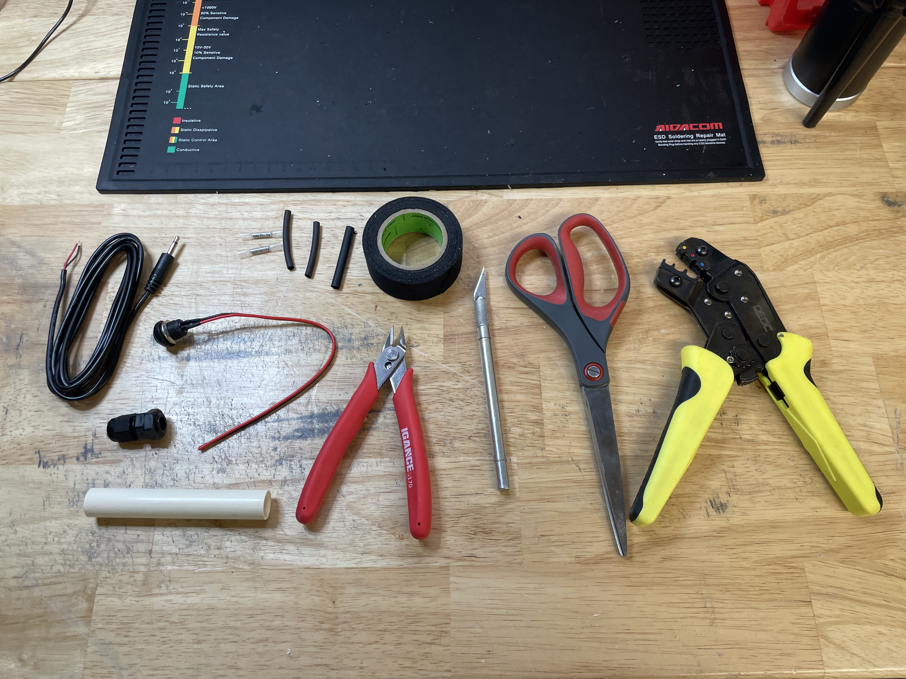
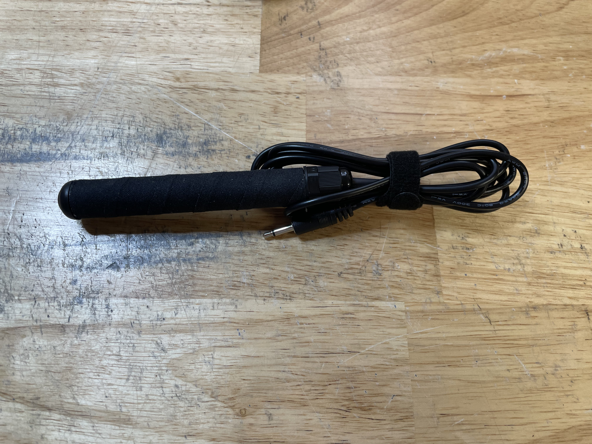

# 🔘 3.5mm Trigger Button

## Parts Needed

* (1) 2-Channel 3.5mm Aux Pigtail
* (1) 12mm Momentary Push Button Switch
* (1) PG7 Cable Gland
* (1) PVC 1/2" Tube (approx 2.5-3")
* (2) Heat Shrink Crimp Splicer
* (1) 3.5mm Heat Shrink Tubing
* (1) 4-4.5mm Heat Shrink Tubing
  * Not represented in the image below, will be <mark style="color:blue;">blue</mark> in further images.
  * (2) 2mm Heat Shrink Tubing pictured below and will not be used.
* (1) Roll of Black Hockey Tape

## Tools Needed

* Small Wire Cutters
* Exacto-Knife (or the equivalent)
* Scissors
* Crimping Tool (or large pliars )
* Heat Gun (attached to a soldering station in this instance)
* Hot Glue Gun with Glue
* Wire Strippers (unfortunately not pictured below)

<figure><figcaption>
Tools and Parts
</figcaption></figure>

 

<figure><figcaption>
Heat Gun (attached to a solder station) and Glue Gun
</figcaption></figure>

## Wrapping the PVC Tube

* Note both ends of the Unwrapped Tube
  * One end is slightly carved out with no threading. This end is the TOP
  * The other side has not been carved out and it set with some threading.

<figure><figcaption>
Top of the PVC Tube (Carved Out)
</figcaption></figure>

 

<figure><figcaption>
Bottom of the PVC Tube (Threaded)
</figcaption></figure>

* Begin by unwrapping the PVC Tube from the top with the Hockey Tape. Wrap diagonally, starting from above the tube, covering about 5mm of the previous wrap as you go down and around the Tube

<figure><figcaption>
Begin wrapping from the top
</figcaption></figure>

 

<figure><figcaption>
Wrapping down the tube, with 5mm overlap
</figcaption></figure>

 

<figure><figcaption>
Wrapped all the way down the tube
</figcaption></figure>

* Snip off the Roll, then cut the excess tape from the top and the bottom of the now Wrapped PVC Tube. Do not worry about the ends of the tape connecting over the holes, this will help later.

<figure><figcaption>
Fully wrapped PVC Tube
</figcaption></figure>

<figure><figcaption>
Cut excess from both ends
</figcaption></figure>

 

<figure><figcaption>
Other end of the cut tape
</figcaption></figure>

* Using some tool (in this instance it is the blunt end of the exacto-knife), press the excess tape down into the tubing. This will leave a nice flat rim of tape around the ends of the Tube.

<figure><figcaption>
Tool flattening the tape
</figcaption></figure>

 

<figure><figcaption>
Tape pressed to the inside of the Tube (top)
</figcaption></figure>

 

<figure><figcaption>
Tape pressed to the inside of the Tube (bottom)
</figcaption></figure>

* With the exacto-knife, slice away the excess tape inside the tube, then set aside for now

<figure><figcaption>
Removed Tape (top)
</figcaption></figure>

 

<figure><figcaption>
Removed Tape (bottom)
</figcaption></figure>

## Button Assembly

* Begin by cutting off the extra cable, leaving the whole button and cable at 5cm. Strip the last 5mm of the two cables. Then remove the bold and washer attached to the Button.

<figure><figcaption>
Cable marked at 5cm total for cutting
</figcaption></figure>

 

<figure><figcaption>
Total button, without removed washer and cables stripped
</figcaption></figure>

* Place the Crimp Splicers on both ends of the stripped cable. Then, using the wire strippers, crimp the end of the Splicer to the exposed cables. Then set aside for later.
* Try not to over crimp the Splicer so the other end can enter the Splicer easily.

<figure><figcaption>
Splicers placed on the exposed cable
</figcaption></figure>

 

<figure><figcaption>
Crimped Splicers (over crimped in image)
</figcaption></figure>

## Cable Order

* For the Aux Pigtail, you will need to slide the different parts down the cable in a certain order in order to properly assemble to Handheld Trigger Button. There are images to coincide with the steps below:

1. 3.5mm Heat Shrink Tubing
2. PG7 Gland (with plastic nut removed)
3. Wrapped PVC Tubing (bottom down)
4. 4-4.5mm Heat Shrink Tubing (pictured <mark style="color:blue;">blue</mark>)

<figure><figcaption>
3.5mm Heat Shrink Tubing
</figcaption></figure>

 

<figure><figcaption>
PG7 Gland (with plastic nut removed)
</figcaption></figure>

<figure><figcaption>
Wrapped PVC Tubing (bottom down)
</figcaption></figure>

 

<figure><figcaption>
4-4.5mm Heat Shrink Tubing (pictured <mark style="color:blue;">blue</mark>)
</figcaption></figure>

## Splicing Aux Cable to Button

* Separate the Red and Black Cables and trip the ends of the cables.
  * There is a small amount of factory solder on the cable, although it is not necessary and may be removed when stripped, but it may be useful when threading the cable through the Splicer.
* Thread the stripped cables into the respective colored cables on the Button Assembly from earlier. Crimp the entire Splicer once the cables are set.

<figure><figcaption>
Stripped Aux cables
</figcaption></figure>

 

<figure><figcaption>
Stripped Aux placed into the Splicer
</figcaption></figure>

<figure><figcaption>
Fully crimped Cables
</figcaption></figure>

* Using the heat gun, shrink the tubing of the Splicer to secure it to the cables

<figure><figcaption>
Applying heat to the Splicer
</figcaption></figure>

 

<figure><figcaption>
Splicer shrunk to the cables
</figcaption></figure>

* Pull the Blue 4-4.5mm Heat Shrink Tubing up to the Splicers and shrink it to the two (pictured below) Splicers.
* Once cool, you should have an assembly like the image below.

<figure><figcaption>
Applying heat to the Tubing over the Splicers
</figcaption></figure>

 

<figure><figcaption>
Partially assembled Trigger Button
</figcaption></figure>

## Assembling the Full Cable

* Begin by applying a smaller dab of glue to the underside of the button. Then slowly lower it to the tube, rotating it to cover the whole of the tube's interior.
* Slice away any excess hot glue that squeezes out from the lip of the button.

<figure><figcaption>
Hot glue applying to the button.
</figcaption></figure>

 

<figure><figcaption>
The glue pressed firmly to the tube
</figcaption></figure>

<figure><figcaption>
Cleaned up top of the Handheld Trigger Button
</figcaption></figure>

* Apply a substantive amount of hot glue down the barrel of the tube, filling the inside and fitting the cable in-place inside the tube.
* Then, make sure there is a small sab of glue on the threads inside the tube, so that the PG7 Gland both has something to thread to and it secured in place.

<figure><figcaption>
Glue being placed down the barrel of the tube
</figcaption></figure>

 

<figure><figcaption>
More glue being applied
</figcaption></figure>

 

<figure><figcaption>
Small dab of glue being placed on the threading
</figcaption></figure>

* Quickly move the PG7 Gland up the cable and thread it into the tube.
  * Remove the two parts of the PG7 Gland, using the threaded end for this step (pictured below)
  * Make sure the gland itself is being twisted into place. Not the cable, and not the tube.
* Slide the 3.5mm Heat Shrink tube into the PG7 Gland about halfway to 2/3 of the way down the tube with a portion of the Shrink Tube exposed.

<figure><figcaption>
PG7 Gland (separated) threaded into the PVC Tube
</figcaption></figure>

 

<figure><figcaption>
3.5mm Heat Shrink Tubing moved into place with the PG7 Gland part ready for threading.
</figcaption></figure>

* Screw down the remaining part of the PG7 Gland onto the Heat Shrink tubing, making sure the hot glue has cooled down enough to not move the gland threaded inside the PVC Tubing

<figure><figcaption>
Partially threaded down onto the Gland and Tubing
</figcaption></figure>

* Next, apply heat to the 3.5mm Heat Shrink Tube. Once the entire assembly has been cooled, apply a cable tie (velcro tie pictured below). Then, the assembly for the Handheld Trigger Button has been completed and is ready for testing and shipment!

<figure><figcaption>
Heat being applied to the 3.5mm Heat Shrink Tubing
</figcaption></figure>

 

<figure><figcaption>
Assembled and Tied Handheld Trigger Button
</figcaption></figure>

