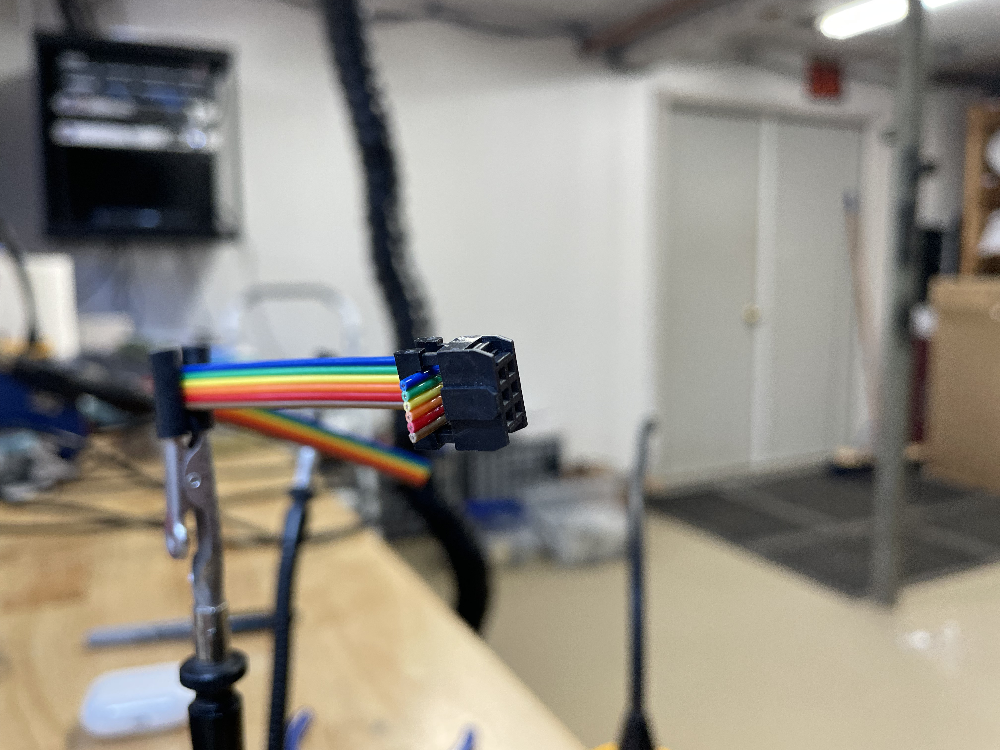

# 🌈 6 Pin Rainbow Door Cable

Tools Needed

* You will need very tools, just a pair of pliers when needed and a clamping tool to cap off the Free Hanging Socket.

<figure><figcaption>
Tools and Parts Needed
</figcaption></figure>

* In addtion to the tools, you will need the following parts:
  * (20cm) 6-Channel Rainbow Cable
    * (25cm) 6-Channel Rainbow Cable - <mark style="color:red;">**for V2 Button Box.**</mark>&#x20;
  * (2) Free Hanging Socket with Cap(s)

## Prepping the Rainbow Cable

* Begin by measuring out 20cm or 25cm of Rainbow Cable, mark it, and cut.

<figure><figcaption>
20cm of Rainbow Cable
</figcaption></figure>

 

<figure><figcaption>
20cm Marked
</figcaption></figure>

 

<figure><figcaption>
Cutting at the line,.
</figcaption></figure>

## Attaching Free Hanging Socket

* Start on the left end of the Rainbow Cable and slide on the Free Hanging Socket (FHS). For proper placement, you will need to place the little clip on the FHS away from the cable and upside down (pictured below). There should be little cable sticking out from the clip, but any excess can be cut away later. The blue stripe of the Rainbow Cable will need to be at the top when assembling.
* To temporarily secure the Socket to the Cable, press down on the Socket gently.

<figure><figcaption>
Free Hanging Socket slipped onto the Cable, with the clip/bump facing away from the Cable
</figcaption></figure>

* Next, flip the Free Hanging Socket up-side-down (pictured below) with the Rainbow Cable looping around the top of the Socket.

<figure><figcaption>
The Free Hanging Socket being looped back around.
</figcaption></figure>

 

<figure><figcaption>
Another angle of the looped Socket
</figcaption></figure>

* Once looped, place the Free Hanging Socket's Cap to the Socket to secure the loop in place.

<figure><figcaption>
Rainbow Cable looped around the top of the Socket with the Cap slightly in place.
</figcaption></figure>

<figure><figcaption>
The Rainbow Cable loosely looped around the top - another angle.
</figcaption></figure>

* Then, press down the Socket Cap with the Rainbow Cable pulled more taut. Once crimped down slightly, it should fit in the Socket Clamp. Gently press on the clamp until you hear a slight **click**. It should be nice and secured once finished.
* Note the length of the small jut-out of Rainbow Cable above the Socket's small Clip, It should be no longer than the clip itself, and will need any excess cut away.

<figure><figcaption>
Clamping down the Socket Clip
</figcaption></figure>

<figure><figcaption>
Fully clamped and ready 6-Pin Free Hanging Socket with Cap
</figcaption></figure>

 

<figure><figcaption>
Another angle. Note the length of the jut-out Rainbow Cable
</figcaption></figure>

* Repeat the steps above, but mirrored on the other end of the Rainbow Cable. Up-side-down with the clip facing away from the rest of the cable.

<figure><figcaption>
Free Hanging Socket on the other end of the Cable
</figcaption></figure>

 

<figure><figcaption>
Flipped and Clamped FHS and Cap
</figcaption></figure>

## Completed Part

* Once completed, you should have a cable resembling the image below. The part is now ready for assembly in a V1 Button Box or a V2 for the longer cable.


[building-the-v1.md](../../devices/button-boxes/v1-button-box/building-the-v1.md)



[building-the-v2](../../devices/button-boxes/v2-button-box/building-the-v2/)


<figure><figcaption>
Completed Rainbow Cable
</figcaption></figure>
