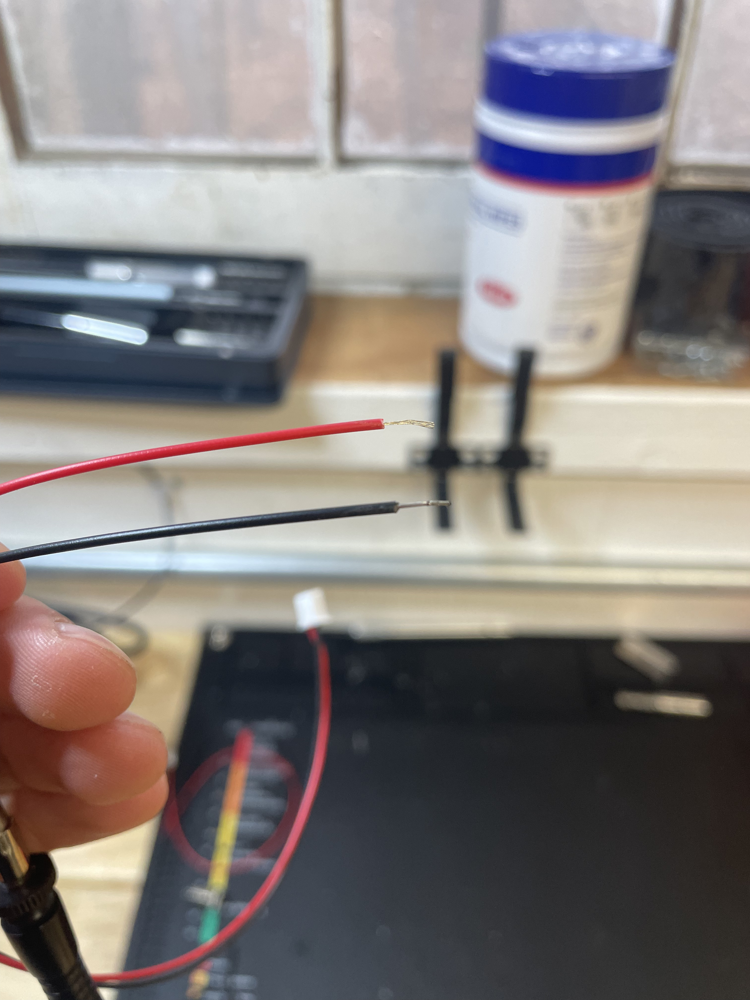

# 🔌 JST Trigger Button Jack

## Tools Needed

* You will need a soldering station with an attached heat-gun in a well ventilated area. In addition, You will need some solder, flux (here we use a no-clean flux with syringe application which is very useful when doing small soldering jobs such as this), and some wire strippers than have a space for small cables. It will be very helpful to have some kind of apparatus to hold the cables/jack when soldering.

<figure><figcaption>
Soldering Station with Heat-Gun
</figcaption></figure>

 

<figure><figcaption></figcaption></figure>

* In addition to the tools, you will need these parts:
  * (1) 300mm 2-Pin JST Cable
    * (1) 150mm 2-Pin JST Cable - <mark style="color:red;">**for V1 Button Boxes**</mark>
  * (2) 2mm Heat Shrink Tubing
  * (1) 3.5mm Heat Shrink Tubing
  * (1) 3-Pin Metal 3.5mm AUX Jack

## Prepping for Soldering

* Begin by sliding the 3.5mm Heat Shrink tubing over both the red and black cables, then slide the 2mm Heat Shrink Tubes down the red and black cables respectively.
* Place the Metal Jack on the your soldering clamps (pictured below).
* Then strip about 5mm at the end of the JST cable for more soldering contact in later steps. There is some solder on the end of the cable from the factory. Although it is not essential, it will help in those later steps if you can manage to keep the solder there. In the below images, the red cable had it solder removed when stripping.

<figure><figcaption>
3.5mm Metal Jack places in a soldering clamp
</figcaption></figure>

 

<figure><figcaption>
3.5mm Tubing down both cables, 2mm down each
</figcaption></figure>

<figure><figcaption>
Stripping the end of the JST Cable
</figcaption></figure>

 

<figure><figcaption>
Example of stripped cable. Note the red cable has no factory solder
</figcaption></figure>

## Wiring Procedure

* Note in the image below that the 2 parallel pins on the 3.5mm Metal Jack have different colors. Although it does not matter in the end which cable is on which end (we are simply making a gate that closes then opens with a single button press) we will be soldering the red cable to the copper pin, located on the left of the Jack (seen below).
* From the outside of the Jack, thread the exposed wire through the small hole on the pins, bending it back towards the cable, and pressing the now looped wire back onto itself to create a kind of hook around the pin. this should make it more secure when in use.
* In the end, you should have a small trip of exposed wire that is just enough to solder it all together.

<figure><figcaption>
Copper pin on the left with hole for threading
</figcaption></figure>

<figure><figcaption>
From the left, the wire being ran through the opening
</figcaption></figure>

<figure><figcaption>
The wire, wrapped back onto itself for soldering.
</figcaption></figure>

* Repeat the steps above for the black cable, looping through the hole on the right side of the right pin. You should have 2 neatly looped wires for soldering.

<figure><figcaption>
The black wire being looped into the pin from the right.
</figcaption></figure>

## Soldering

* Apply a small amount of flux to the exposed wire and pins. A little goes a long way.

<figure><figcaption>
Small dabs of flux applied to the exposed wire
</figcaption></figure>

* Apply a small bead of solder to your soldering tool, then quickly apply it to the exposed pin and wires. A successful solder should have a sheen to it, will be smoothed over, and will not be loose inside the pin. The heat may melt some of the plastic, and a little wiggle room caused by it is fine inside the jack.
* Afterwards, slide the 2mm Heat Shrink Tubes up to the jack and have them meet at the very end of the jack, completely covering the solder and pins. The "X" shape next to the pins will probably get in the way, but as long as a small amount of solder was used, it should fit well there (pictured below).

<figure><figcaption>
The exposed wire being soldered next to an active vacuum filter for ventilation
</figcaption></figure>

<figure><figcaption>
Both wired properly soldered
</figcaption></figure>

 

<figure><figcaption>
2mm Heat Shrink Tubing placed at the base of the jack
</figcaption></figure>

## Heat Shrink Tubing

* Once the 2mm tubes are in place, you will need to apply the heat gun to the tubes, locking them in place. Note that when this is done, there is no way to undo it or move the tube without tearing it out and restarting the whole Jack assembly.
* When those have shrunk, give it a second to cool down before sliding the 3.5mm tube up the wired and over the ends of the 2mm tubing to create a more secure and protected cable in a vulnerable area.

<figure><figcaption>
Heat gun being applied to the tubing
</figcaption></figure>

 

<figure><figcaption>
Shrunk and in-place tubing
</figcaption></figure>

<figure><figcaption>
3.5mm tubing slid up to the 2mm tubes
</figcaption></figure>

 

<figure><figcaption>
All tubes shrunk into place.
</figcaption></figure>

## Completed Assembly

* Once the tubes have cooled down, you should have a working 3.5mm Metal Aux Jack, ready for use in the V1 and V2 Button box:


[building-the-v1.md](../../devices/button-boxes/v1-button-box/building-the-v1.md)



[building-the-v2](../../devices/button-boxes/v2-button-box/building-the-v2/)


<figure><figcaption>
Fully assembled 3.5mm Metal AUX Jack
</figcaption></figure>
