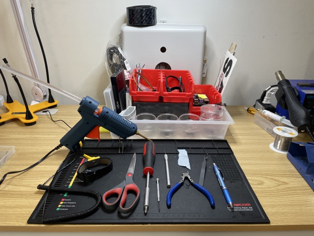

# Building the V2

### Tools List

#### From left to right we have:

* Hot Glue Gun (preferably with a longer nozzle for harder to reach places)
* Ant-Static Work Mat
* Scissors
* Medium Philips Head Screwdriver
* Small Flat Head Screwdriver
* Exacto Knife
* Small Strip of Sandpaper (lower grit)
* Durable Wire Clipper
* Angled Tweezers
* Pen

<figure><figcaption>
Your essential tools
</figcaption></figure>

### Parts List

_Although these are just the essentials, feel free to use whatever you have to get the job done. For the list of all parts needed, refer to this list:_&#x20;

<figure><figcaption></figcaption></figure>

 

<figure><figcaption></figcaption></figure>

