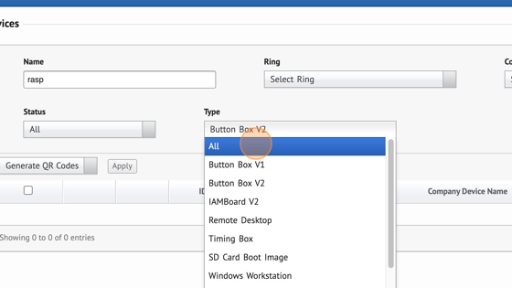

# 2️ Part 2: Registering the Device as a V2 Button Box

## [Part 2A](part-2a-discovering-the-v2-pi-stack.md)

This section covers finding the IP Address of the V2 Pi Stack and appearing in Showground's device backend.

<figure><figcaption></figcaption></figure>

## [Part 2B](part-2b-mounting-the-m.2-drive.md)

Here describes the process of mounting the M.2 Drive attached to the V2 Pi Stack.

<figure><figcaption></figcaption></figure>

## [Part 2C](part-2c-registering-the-pi-stack-as-a-v2.md)

This final section turns the V2 Pi Stack into a V2 Button Box, enabling more configuration of the device as a whole.

<figure><figcaption></figcaption></figure>
