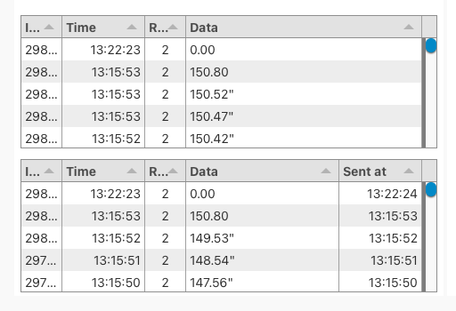

# Testing the Timer Hardware

## Testing USB Cable/Serial Data

To ensure that the Timer node is able to receive data follow these steps:

1. Begin by plugging in the _<mark style="color:red;">USB to Serial Adapter</mark>_ into one of the USB Ports on the back of the Timer Node.
2. Next, insert the _<mark style="color:red;">Serial to 3.5mm Adapter</mark>_ into the Output Port on the back of the _<mark style="color:red;">FarmTek Farm Timer</mark>_. Ensure the timer is powered on and configured correctly using the following link: [FarmTek - Configure Farm Timer for Timer Node](https://app.gitbook.com/s/BPGAxh8zHKqY3PJEk3gH/timing-and-scoring/farmtek-configure-farm-timer-for-timer-node).

> _<mark style="color:red;">The timer needs to be at least set to</mark>_ Printer Type: ASCII Float/Hrn _<mark style="color:red;">and</mark>_ Baud Rate: 4800

<figure><figcaption>
FarmTek Timer (temp image)
</figcaption></figure>

3. Connect the two adapters from each device. (The USB to Serial on the Timer Node and the Serial to 3.5mm on the FarmTek)
4. Then on your browser of choice: open the UI Dashboard for Timer Node in the Showground's Device Page. You can also access this page by entering the IP Address of the Timer Node into your browser's search bar followed by ":1880/ui". For example:

> _<mark style="color:red;">10.0.20.123:1880/ui</mark>_

5. Start the timer on the FarmTek by pressing large black mechanical Start/Stop switch.
6. On dashboard verify that the time data is visible (as shown below). If everything is displayed with no errors then the Timer Node has been hardware tested and is ready for software (which will not be a lot).

<figure><figcaption>
Timing data from the UI Dashboard
</figcaption></figure>
