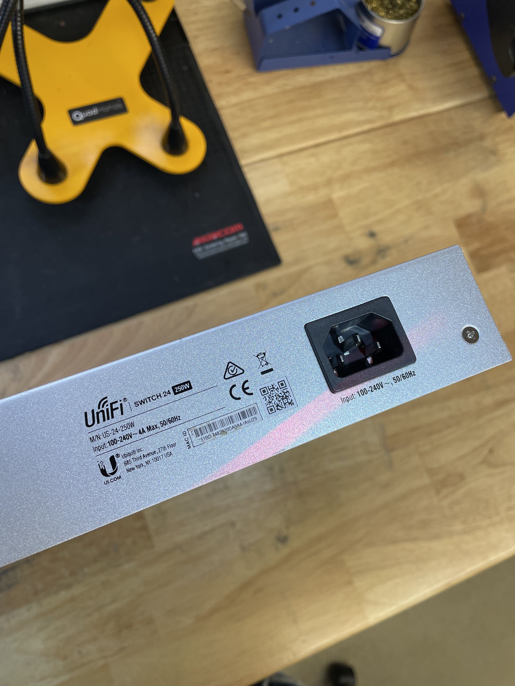

# 🎛️ Creating A New Asset in Snipe.It

## How to Create A New Asset

[**Made by Jaimee Tempest with Scribe**](https://scribehow.com/shared/How\_to\_Create\_a\_New\_Asset\_Model\_and\_Inventory\_Asset\_\_\_VifwqACQ5-tI8to9oKyRA)

1. Navigate back to the menu on the left and hover over the Barcode Icon to reveal the list of Asset Labels, click "List All"

2. Click "Create New" in the top right.

3. Click "Select Company" and select "Showgrounds, LLC" from the small list.

4. Click the "Asset Tag" field since this device has been tagged with an SGL Asset Tag. Since this is a Ubiquiti device, we are going to label it "sgl-ubiquiti-0154". This will not always be the case with every device.

5. Click the "Serial" field.

6. Since we do not have a visible S/N to work from anyways, we are going to use the Barcode Scanner to scan the QR Code on the back of the asset. Click on the "Serial" field and scan the code to enter it.

<figure><figcaption>
Bar Code Scanner about to read the QR Code
</figcaption></figure>

7. Click "Select a Model" and type out some identifying information about the Asset Model. In this case, I searched "250W" in the field to find the correct model.

8. Searching brought up the correct model, in this case: "Server Equipment - Ubiquiti UniFi Switch 24 250W (#US-24-250W)"

9. Click "Select Status"

10. Click "Ready to Deploy". Since this device is not being shipped out after we add it to the system, we will not be checking-out the asset.

11. After entering any needed notes, click "Select a Location" and select "--Main Office Inventory" from the drop-down.

12. Click the "Inventory Location" field. The location of this device will depend on what kind of asset it is. There is a specific ruleset for inventory as such:\
    (SHELF LETTER)-(TOP/SHELF/FLOOR)-(SHELF#(SIDE LETTER))

<figure><figcaption>
Inventory Floor Plan
</figcaption></figure>

13. In this case, it will be stored with the other Ubiquiti equipment, so we enter:\
    "A-Shelf-2"

14. Click "Save" in the bottom right when you are done!

[**Made with Scribe**](https://scribehow.com/shared/How\_to\_Create\_a\_New\_Asset\_Model\_and\_Inventory\_Asset\_\_\_VifwqACQ5-tI8to9oKyRA)
