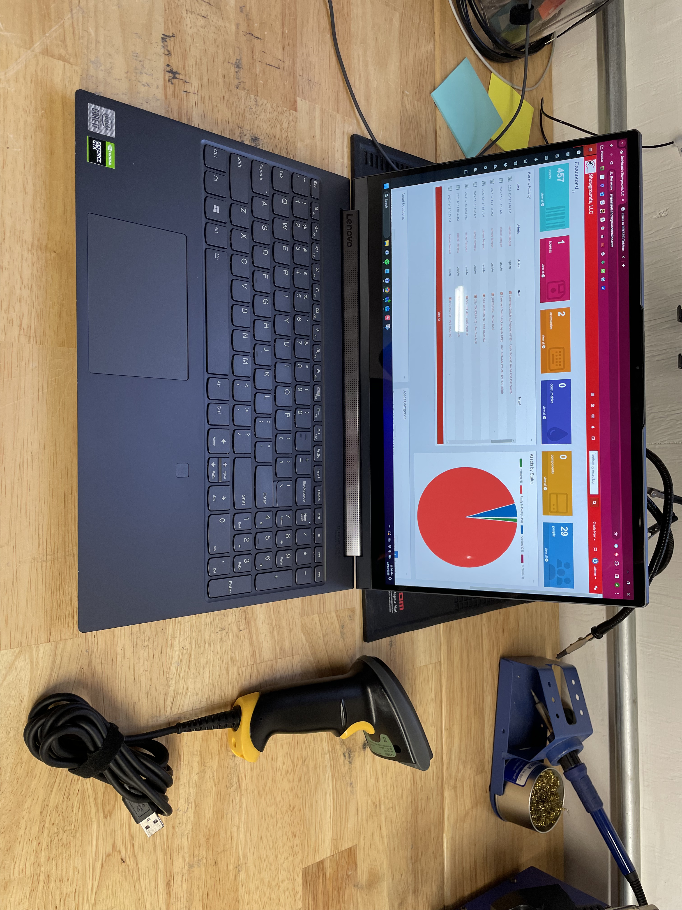
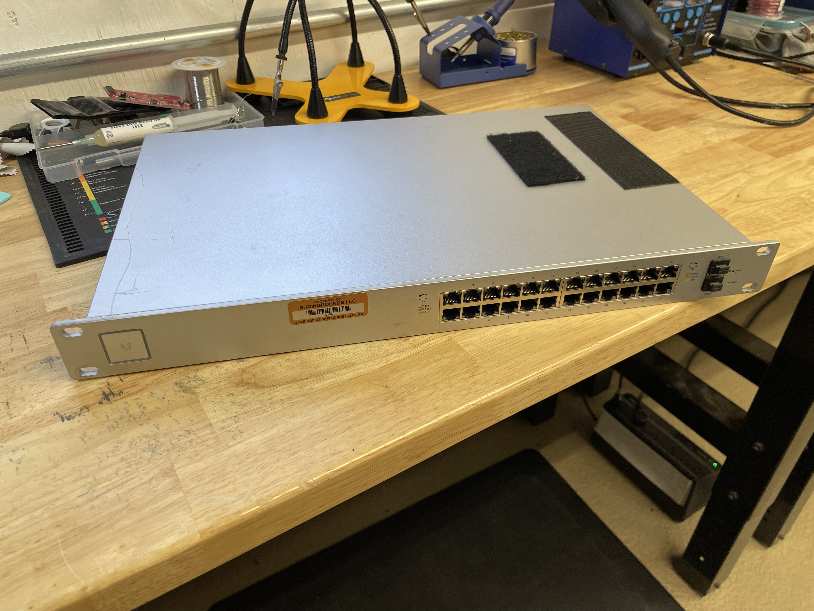
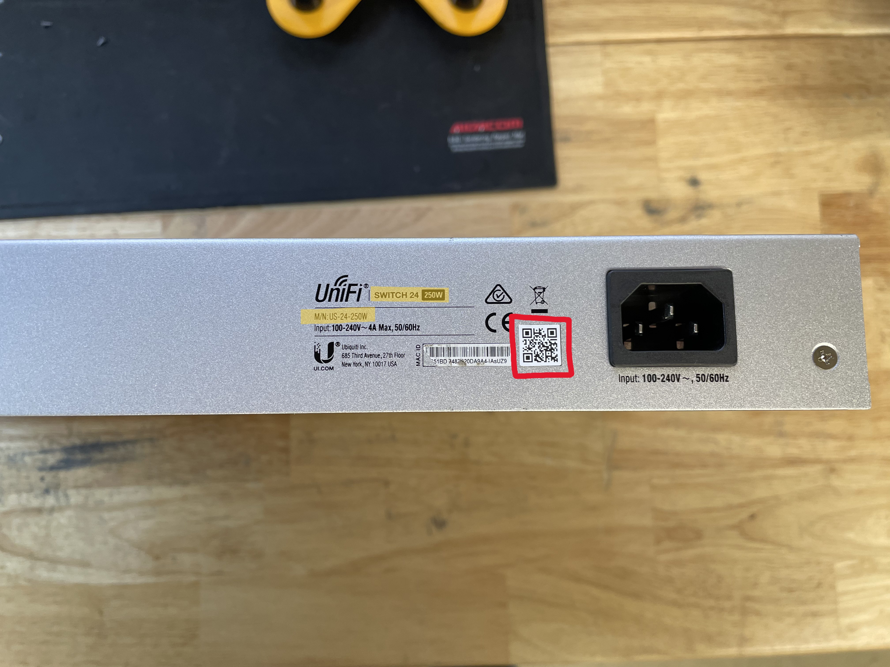
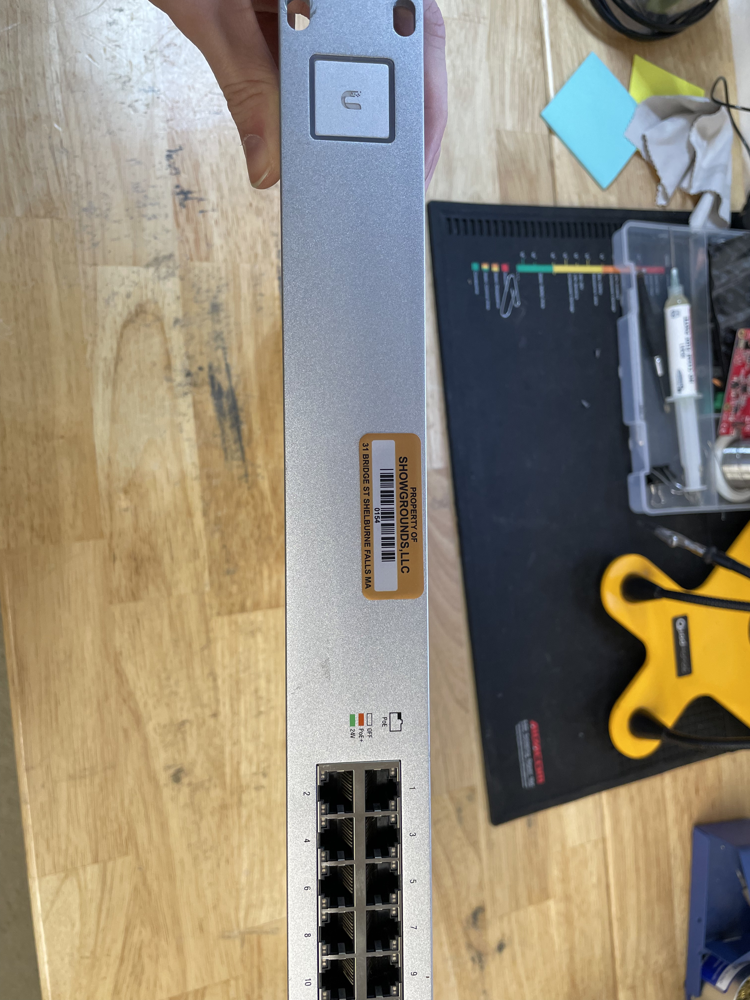

# ⚙️ Creating A New Asset Model in Snipe.it

## Tools Need

* A computer connected to the internet and Snipe.it at: [http://snipeassets.showgroundsonline.com/](http://snipeassets.showgroundsonline.com/)
* An item to be added to inventory
* A barcode scanner

<figure><figcaption>
Windows 11 Laptop and Barcode Scanner
</figcaption></figure>

 

<figure><figcaption>
Asset to be Inventoried
</figcaption></figure>

## Finding the Model and Serial Numbers (M/N and S/N)

* Devices may have more than one serial number that we use to track assets, below is an example that has manufacturers numbers and SGL numbers.
* Look for the <mark style="color:red;">Model Number</mark> or <mark style="color:red;">M/N</mark> of the device. The asset below has a highlighted M/N of \
  "_US-24-250W_"&#x20;
* Sometimes the physical numbers are damaged or missing on a device, this is where the barcode scanner is needed (and will speed up the process). The device below is such a device and needed to scan the QR code to get the manufacturer's <mark style="color:red;">Serial Number</mark> or <mark style="color:red;">S/N</mark>.
* This asset has also been adorned with a tamper-proof <mark style="color:red;">Asset Tag</mark> by SGL (in this instance it is 0154) and is how we can quickly identify valuable/self built devices. Some devices have a S/N made by the inventory team and will be tagged with a simple label.

<figure><figcaption>
A Unifi Switch 24 with highlighted 
</figcaption></figure>

 

<figure><figcaption>
An SGL Asset Tag
</figcaption></figure>

## Creating the Asset Model in Snipe.It

* We will need an image of the device before making the model in Snipe.it ([http://snipeassets.showgroundsonline.com/](http://snipeassets.showgroundsonline.com/)).

## How to Create a New Asset Model

[**Made by Jaimee Tempest with Scribe**](https://scribehow.com/shared/How\_to\_Create\_a\_New\_Asset\_Model\_and\_Inventory\_Asset\_\_\_VifwqACQ5-tI8to9oKyRA)

1. Navigate to your search engine of choice, in this case we will use Google.
2. Since we have an Asset sold commercially, we can search for a product image to use. Search the device's manufacturer and M/N, then click "Images"

3. Find an image that might work for the device you are adding.

4.  Right-click this image and in the menu choose "Save Image As". A new window will appear, make sure that the file type is one of the following:

    Accepted filetypes are jpg, webp, png, gif, and svg. Max upload size allowed is 2M.

5. In a new tab, navigate to [http://snipeassets.showgroundsonline.com/](http://snipeassets.showgroundsonline.com/)
6. Click "Asset Models" from the pop-out menu over the "Settings" Gear Icon on the left of the website.

7. Click "Create New" in the top right.

8. Click the "Asset Model Name" field and type the general name of the asset you are adding. In this case it is "UniFi Switch 24 250W"

9. Click "Select a Manufacturer" and select the correct option from the drop-down. If the manufacturer is not listed, add it with the "New" button to the right of the menu.

10. Click "Select a Category" and again, select the appropriate category for this inventory in the drop-down.

11. Click the "Model No." field and enter the M/N you had noted from before. In this case it is again "US-24-250W"

12. Click "Do Not Depreciate" and change it to a 3-Year Depreciation

13. Click the "EOL" field and type in the standard 24 Months

14. Click the "Fieldset" menu and select "Inventory Information" from the drop-down

15. Click "Select File..." and find the image we had downloaded for the asset, click "Upload".

16. Click "Save" when you are finished!

[**Made with Scribe**](https://scribehow.com/shared/How\_to\_Create\_a\_New\_Asset\_Model\_and\_Inventory\_Asset\_\_\_VifwqACQ5-tI8to9oKyRA)
